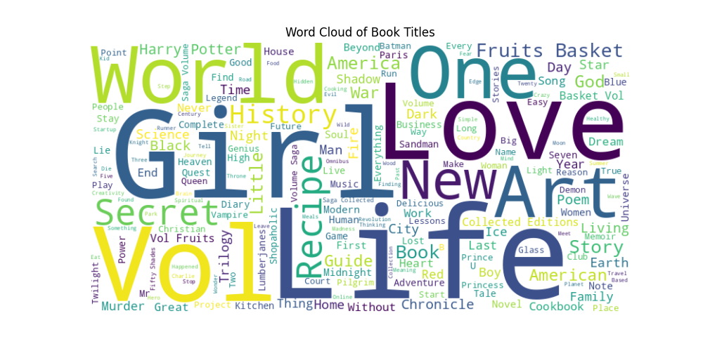
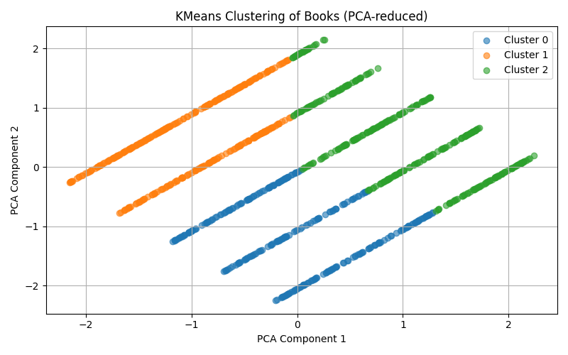
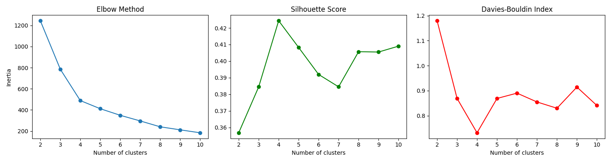
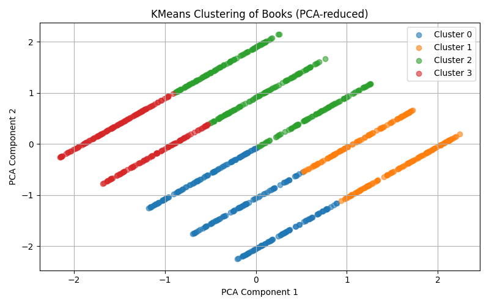
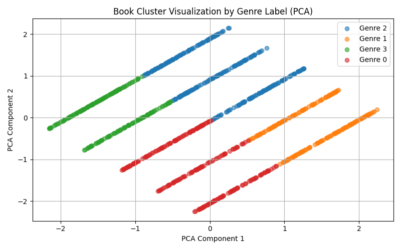
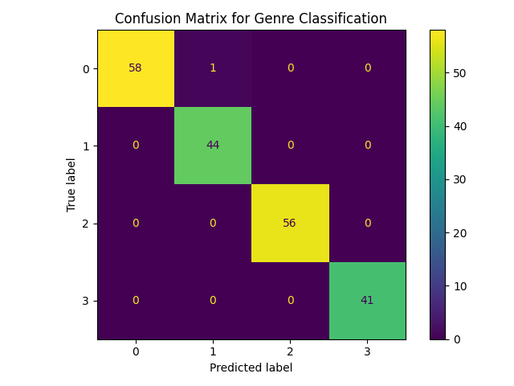

## 📚 Book Dataset Analysis & Classification

### ✅ Task 1: Generate a Word Cloud using Book Titles

**Objective:**
Create a word cloud from all book titles to visualize the most common keywords found in them.

**Result:**
An image `wordcloud.png` was generated showing the most frequent words in book titles.

This image highlights common terms such as "Life", "Love", "Girl", "World", and others — offering insight into the themes and focus of many books in the dataset.

---

### ✅ Task 2: Unsupervised Learning with KMeans Clustering

**Objective:**
Group books into clusters based on their price and rating using the KMeans algorithm.

**Result:**
- Each book now has a `cluster` label indicating which group it belongs to.
- Below is a visualization of the clusters:

In this 2D plot (after PCA), each dot represents a book. Colors represent clusters 0, 1, and 2. We see clear separation between groups, indicating meaningful clustering based on price and rating.

Cluster 0 (blue): possibly low price, average rating

Cluster 1 (orange): possibly average price and rating

Cluster 2 (green): possibly high price, good rating

---

### ✅ Task 3: Determine Optimal Number of Clusters

**Objective:**
Use evaluation metrics to determine how many clusters best describe the data.

**Result:**

**Interpretation:**
- **Elbow method**: Noticeable "elbow" at `k=4`, where inertia decreases less sharply — a good sign.
- **Silhouette Score**: Peaks at `k=4`, indicating good separation between clusters.
- **Davies-Bouldin**: Lowest at `k=4`, meaning clusters are compact and well-separated.

Chosen optimal `k = 4`.

### 🔄 Re-run Clustering with `k=4`
Performed clustering again with 4 clusters and visualized the result:

Each dot is a book, and each color shows a different cluster. This shows an even more nuanced division than with 3 clusters.
Visualization shows that clustering with k=3 produces good groups.
But k=4 is even better in terms of metrics, and it is visually clear that an additional “area” has appeared that was previously included in other

---

### ✅ Task 4: Genre Info

**Objective**
Save the updated dataset with clustering results, including placeholder columns for genre information and visualize how the books are distributed

**Result**
-Generated file books_clustered.csv containing all book data, assigned clusters, and placeholder genre info for future use.

In this plot, each point is a book, and its color corresponds to a genre label (which currently matches the cluster number). This helps to visually analyze how books are grouped and suggests potential genre separation.
The axes in this plot (PCA Component 1 and 2) are not actual feature values like price or genre. They are new coordinates created by PCA to capture the most important variance in the data. These values can be positive or negative and do not correspond directly to genre labels or other features. The color of each point shows the assigned genre label, but its position is derived from PCA transformation.

---

### ✅ Task 6: Genre Classification with MLPClassifier

**Objective**
Train a neural network model (MLP) to classify books into genre labels using only price and rating as input features.

**Model:**

MLPClassifier(hidden_layer_sizes=(32, 16), activation='relu', solver='adam', max_iter=500)

**Result**

-Model achieved high accuracy due to the genre labels being derived directly from clusters based on price and rating.

**Interpretation**

Each row represents the true label, and each column — the predicted label.

Most predictions fall on the diagonal (correct classification).

Very few errors — for example, only 1 book from Genre 0 was misclassified as Genre 1.

Shows that with these simplified labels (from clustering), MLP can easily learn the pattern.