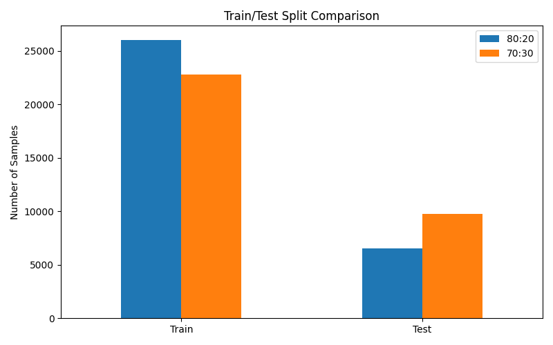
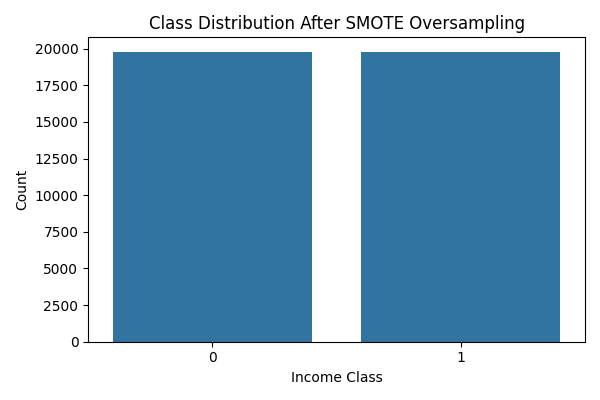
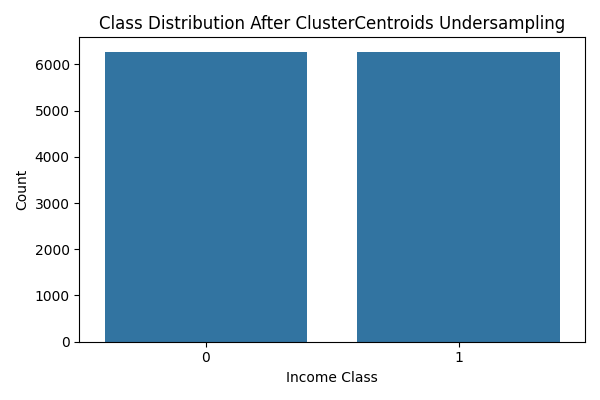
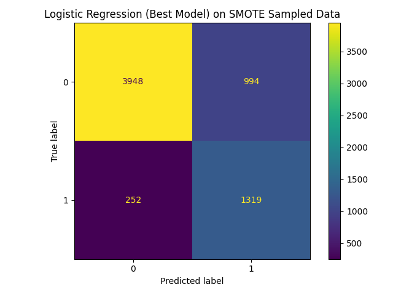
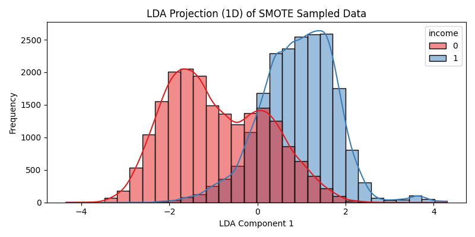
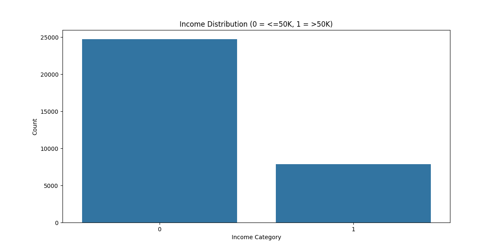
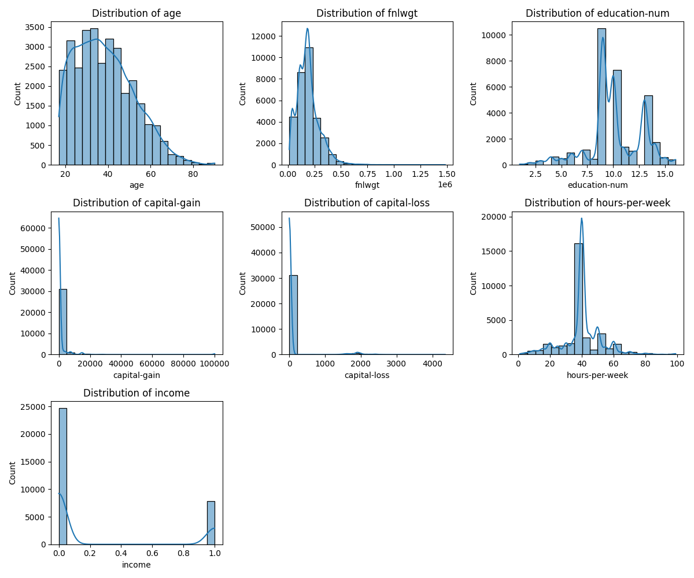

# Logistic Regression on Imbalanced Adult Dataset

## 🌍 Dataset
- **Source**: [UCI Adult Dataset](https://archive.ics.uci.edu/dataset/2/adult)
- **Goal**: Predict whether income >50K or <=50K

---

## ✅ Task Overview

### 1. One-hot encoding
- Applied `OneHotEncoder` to all categorical features except the target (`income`).
- Used `drop='first'` to avoid dummy variable trap.

### 2. Normalization
- All numerical features scaled to [-1, 1] range using `MinMaxScaler`.
- This helps improve model convergence and ensures consistent scales.

### 3. Train/Test Splits
- Data split into:
  - **80:20** (train:test)
  - **70:30** (train:test)
- Visual comparison:

---

### 4. Sampling Methods

#### ✊ SMOTE (Oversampling)
- Balances dataset by synthetically generating minority class samples.
- Applied to training data.

#### 🚫 ClusterCentroids (Undersampling)
- Reduces size of majority class by replacing samples with centroids.
- Preserves balance with minimal data.

---

### 5. Logistic Regression + Hyperparameter Tuning
- Used `GridSearchCV` to tune:
  - `C` (Regularization strength)
  - `penalty` (l2)
  - `solver` (lbfgs)

**Confusion Matrix on Test Set (after SMOTE):**

---

### 6. Linear Discriminant Analysis (LDA)
- Used to reduce feature space to 1D for binary classification.
- Helped visualize class separation post-SMOTE.

---

## 📊 Exploratory Visualizations

### Distribution of Target Before Sampling:

### Distribution of Normalized Features:

---

## 🎓 Conclusion
- **SMOTE** significantly improved class balance and recall.
- **LDA** confirmed linear separability potential.
- Logistic Regression performs well on normalized and balanced data.

