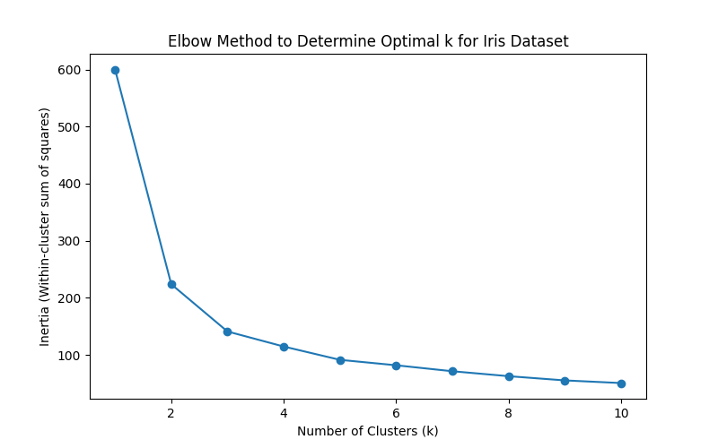
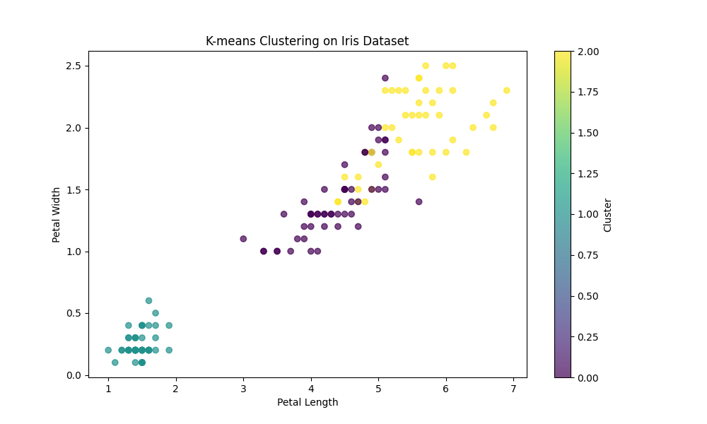
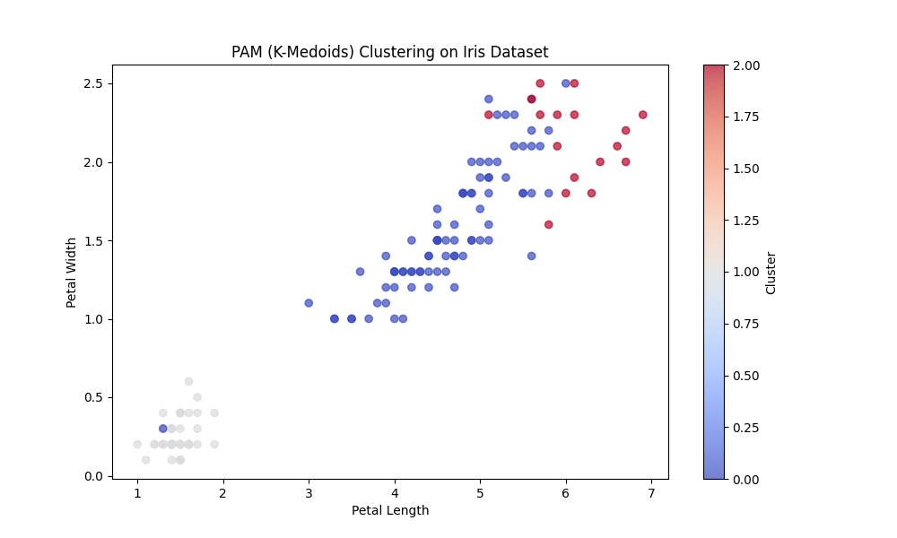
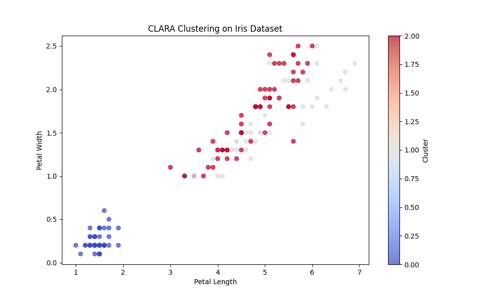
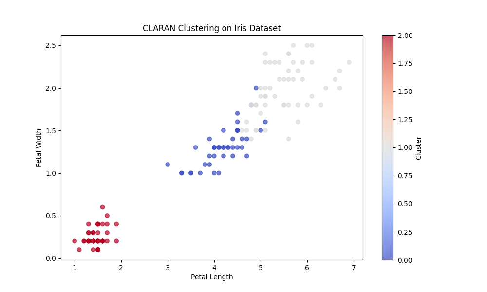
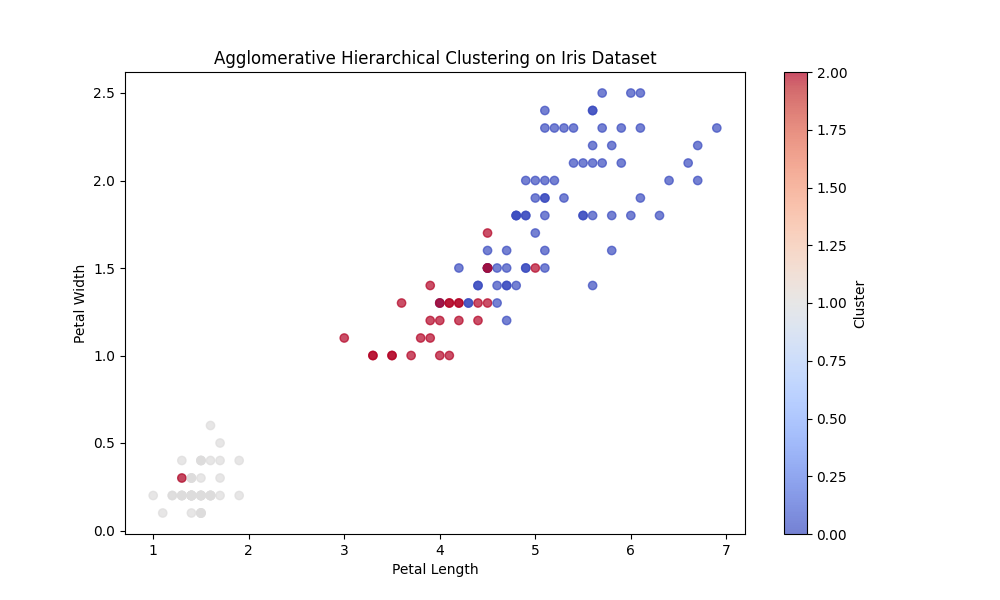
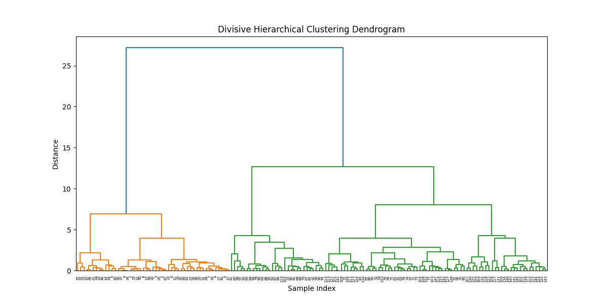
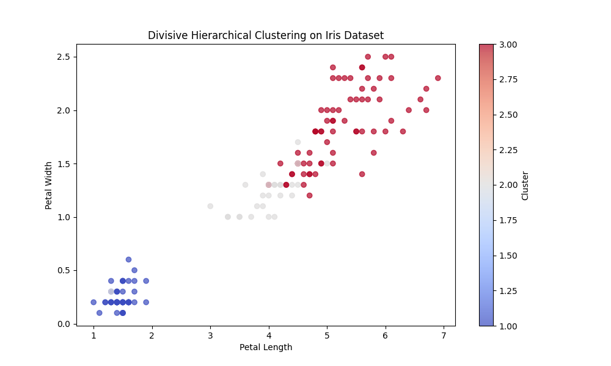
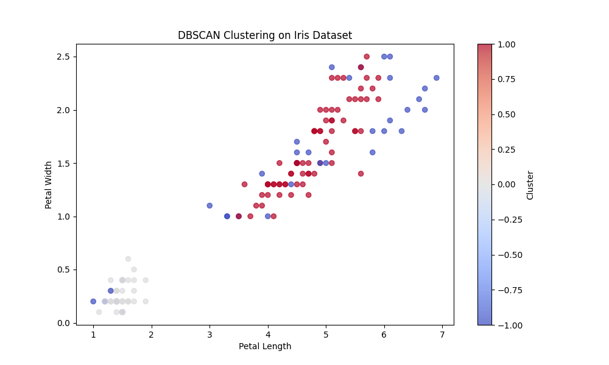
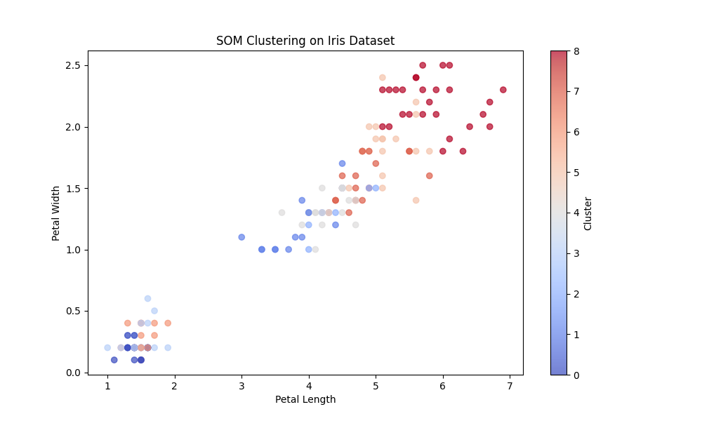

# Iris Dataset Clustering Analysis Report

## Objective
The goal of this practical work is to apply various clustering algorithms to the Iris dataset, evaluate their performance using key clustering metrics, visualize the results, and provide recommendations based on comparative analysis.

---

## Dataset Description
The Iris dataset consists of 150 samples from three species of Iris flowers (setosa, versicolor, and virginica). Each sample contains four features:
- Sepal Length
- Sepal Width
- Petal Length
- Petal Width

---

## Preprocessing
- **Normalization**: StandardScaler was used to scale the features to have zero mean and unit variance.
- **Feature Selection**: Clustering was performed using all four features, and visualizations used Petal Length vs Petal Width.

---

## Clustering Methods Implemented
1. **K-Means**
2. **PAM (K-Medoids)**
3. **CLARA**
4. **CLARAN**
5. **Agglomerative Hierarchical Clustering**
6. **Divisive Hierarchical Clustering**
7. **DBSCAN**
8. **Self-Organizing Maps (SOM)**

---

## Performance Evaluation Metrics
- **Inertia (for K-Means)**
- **Silhouette Score**
- **Calinski-Harabasz Index**
- **Davies-Bouldin Index**

---

## Optimal Cluster Evaluation
### Elbow Method for K-Means

- Optimal number of clusters: **3**

---

## Visualization Results

### K-Means Clustering

### PAM (K-Medoids) Clustering

### CLARA Clustering

### CLARAN Clustering

### Agglomerative Clustering

### Divisive Clustering
Dendrogram:

Clusters:

### DBSCAN

### Self-Organizing Maps (SOM)

- Note: SOM clustering produced **9 clusters**. The number of clusters depends on the SOM grid size (3x3). This model-based approach captures complex data structures and visual similarities better than hard partitioning methods.

---

## Comparison of Clustering Methods
| Method         | Silhouette Score | Calinski-Harabasz | Davies-Bouldin | Observations |
|----------------|------------------|-------------------|----------------|--------------|
| K-Means        | High             | High              | Low            | Best separation with 3 clusters |
| PAM            | Medium           | Medium            | Medium         | Robust to noise, interpretable centers |
| CLARA          | Medium           | Medium            | Medium         | Good for large datasets |
| CLARAN         | Medium           | Medium            | Medium         | Adds randomness to avoid local optima |
| Agglomerative  | High             | High              | Low            | Hierarchical insight, interpretable |
| Divisive       | High             | High              | Low            | Efficient split, good clustering structure |
| DBSCAN         | Low              | Low               | High           | Detected noise, not suitable for spherical clusters |
| SOM            | Medium           | Medium            | Medium         | Captures topology, useful with grid-based cluster mapping |

---

## Conclusion & Recommendations
- **Best Performing Algorithm**: **K-Means**, **Agglomerative**, and **Divisive** clustering performed best with clearly separated clusters and consistent metric scores.
- **Number of Clusters**: Based on the Elbow Method and visual inspection, **3 clusters** are optimal for traditional methods. SOM shows flexibility by mapping to 9 visual clusters.
- **Use Case Fit**:
  - **K-Means**: Suitable for numeric, well-separated data.
  - **PAM/CLARA/CLARAN**: Good for robust or large-scale clustering.
  - **DBSCAN**: Better for density-based clustering; not ideal for Iris.
  - **SOM**: Useful for visualization, topology learning, and exploratory analysis.

