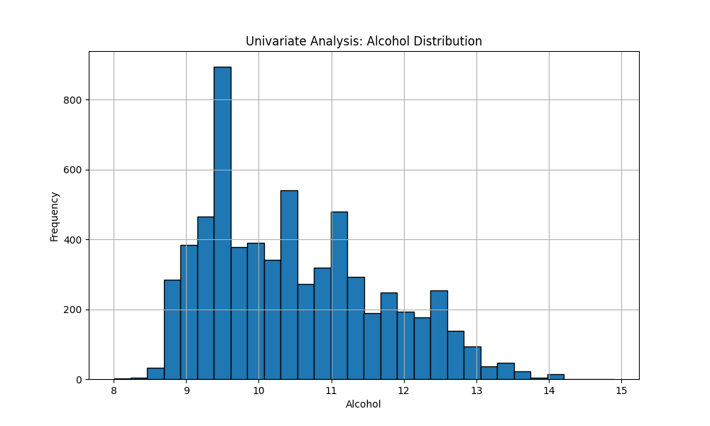
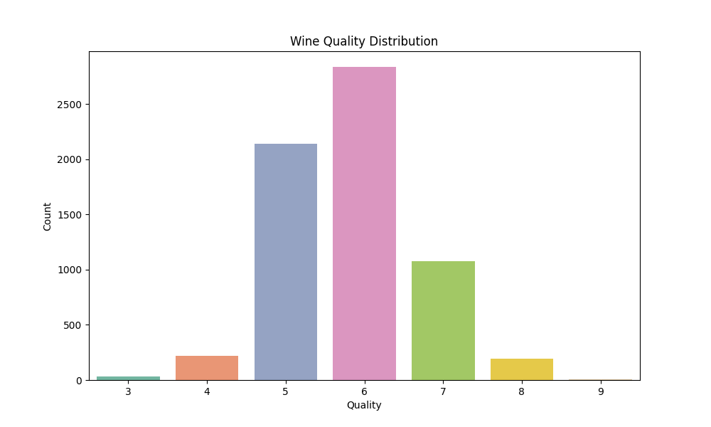
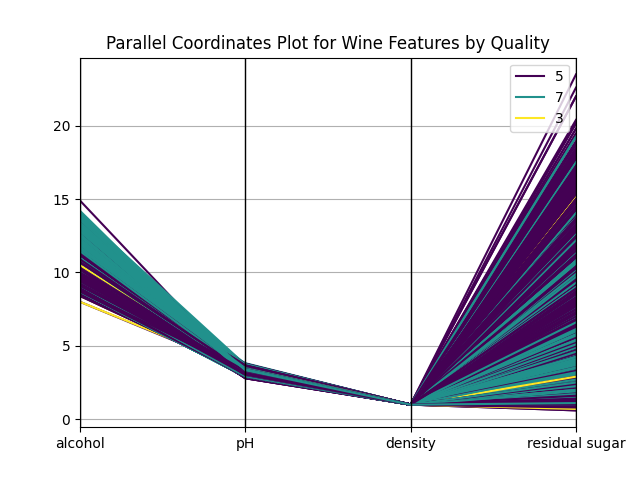
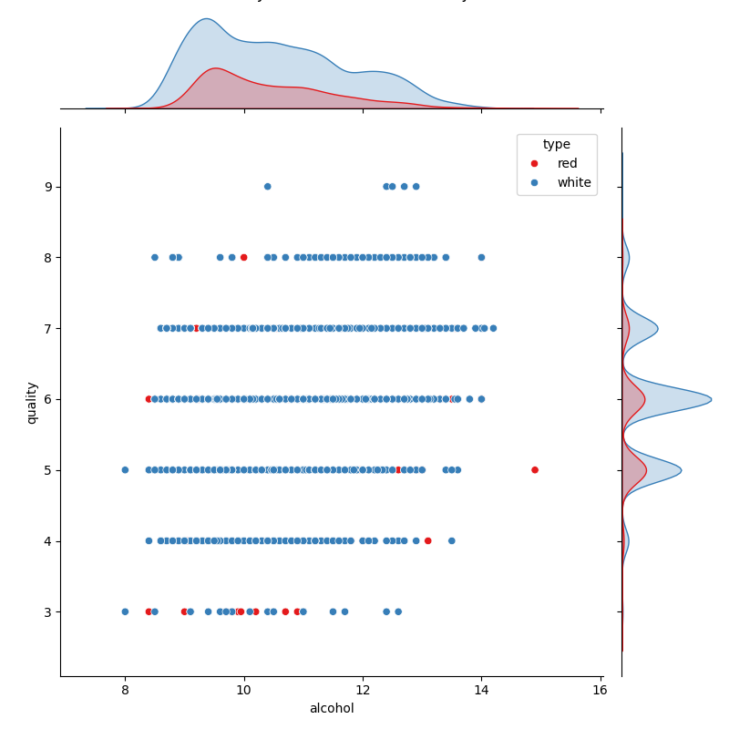
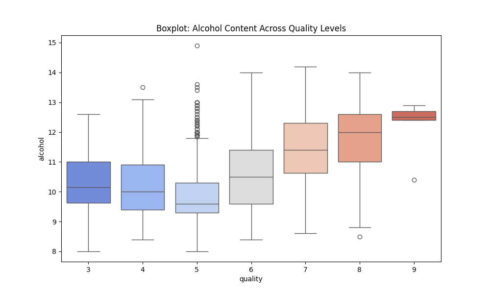
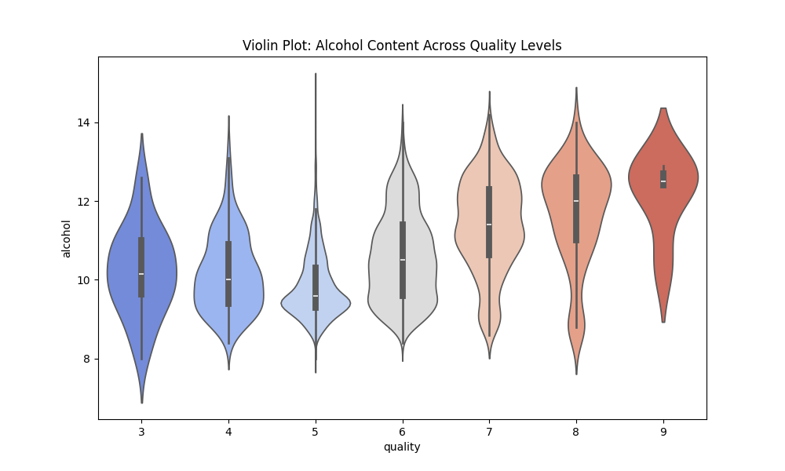
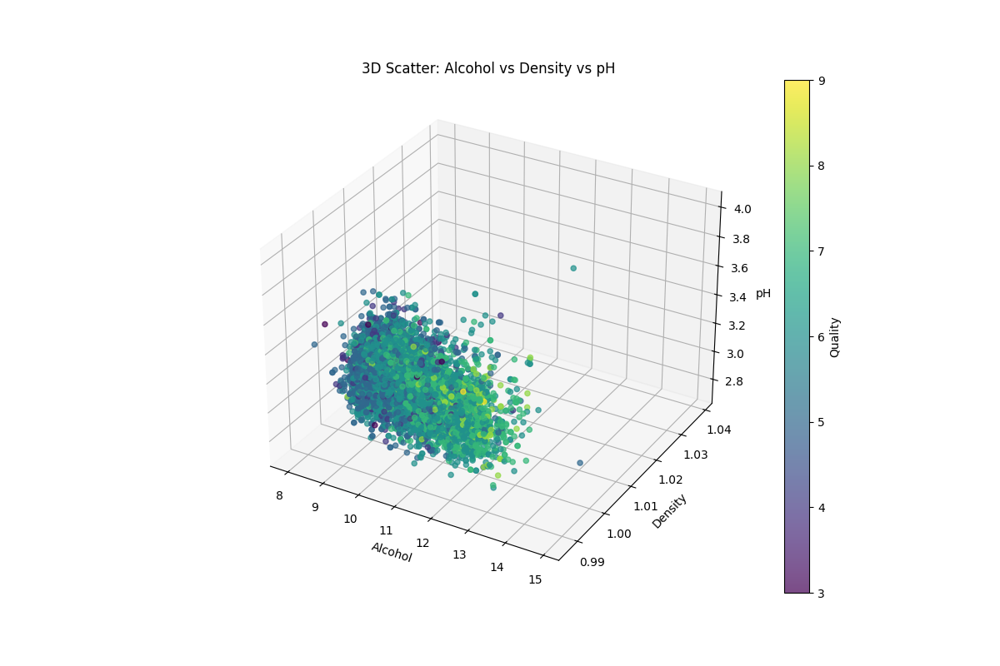
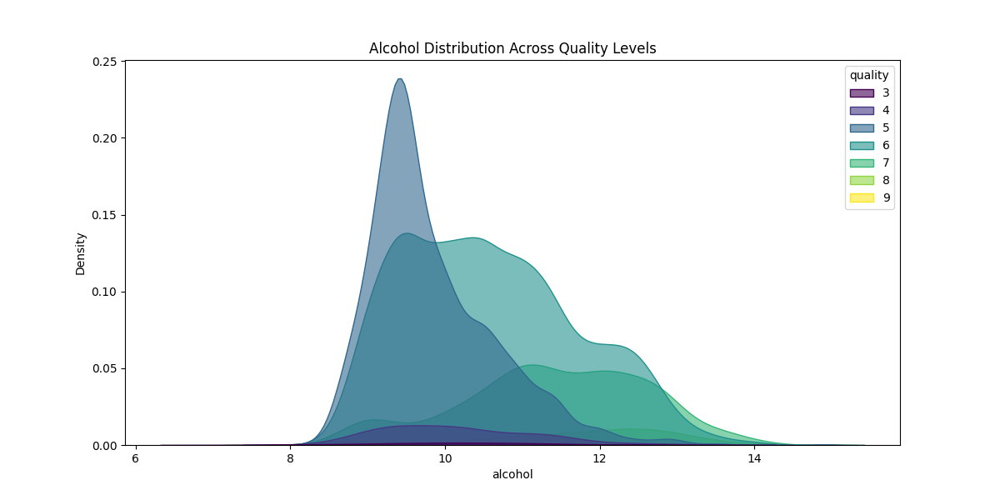

# Wine Quality Dataset - Data Analysis Report

This report summarizes the exploratory data analysis and visualizations performed on the combined red and white wine quality datasets.

---

## ✅ Dataset Overview
- **Source**: `winequality-red.csv` and `winequality-white.csv`
- **Attributes**: 12 columns per entry (physicochemical tests + quality score)
- **Total entries**: Combined ~6497 entries (1599 red + 4898 white)

---

## 1. Univariate Analysis
**Alcohol Content Distribution**
- Alcohol values are mostly concentrated between 9% and 12%.
- Right-skewed distribution: higher frequency for mid-range alcohol levels.

---

## 2. Categorical Attribute Analysis (1-D)
**Quality Distribution**
- Most wines are rated between 5 and 7.
- Ratings 3, 4, 8, and 9 are relatively rare.

---

## 3. Multivariate Analysis
**Parallel Coordinates Plot**
- Used to visualize `alcohol`, `pH`, `density`, and `residual sugar` grouped by `quality`.
- Clear visual separation for lower vs. higher quality wines based on alcohol and sugar.

---

## 4. Joint Plot: Alcohol vs Quality
- Shows a relationship between higher alcohol levels and higher quality ratings.
- White wines dominate the higher alcohol and quality space.

---

## 5. Boxplot and Violin Plot: Alcohol vs Quality
- **Boxplot** shows median alcohol content increases with wine quality.
- **Violin plot** shows wider distributions in mid-range qualities (e.g., 5, 6).

**Boxplot:**

**Violin Plot:**

---

## 6. 3D Scatter Plot: Alcohol vs Density vs pH
- Wines with higher alcohol tend to have lower density.
- No strong pattern for pH, but quality varies more clearly with alcohol.

---

## 7. KDE Plot: Alcohol Distribution Across Quality Levels
- Alcohol distribution shifts to the right (higher alcohol) as quality increases.
- Quality 8 and 9 wines have the highest alcohol concentration.

